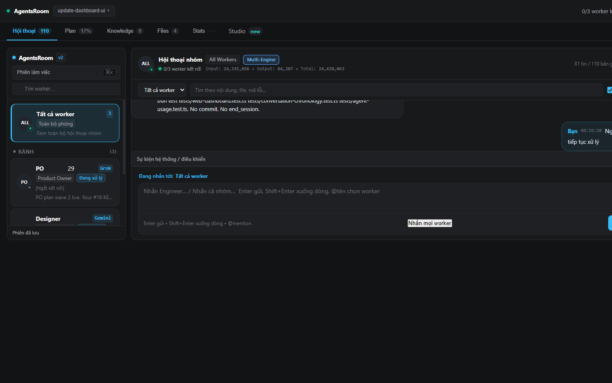
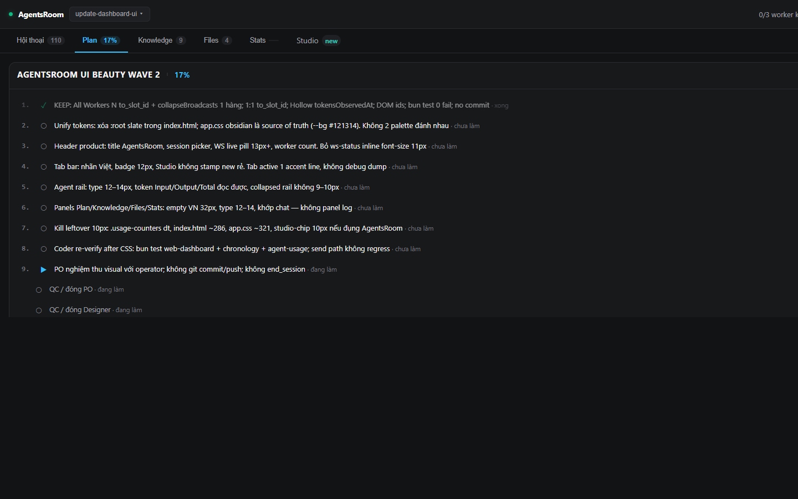
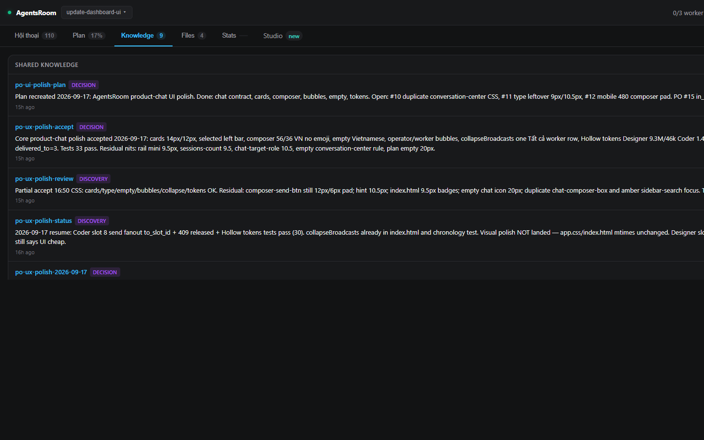
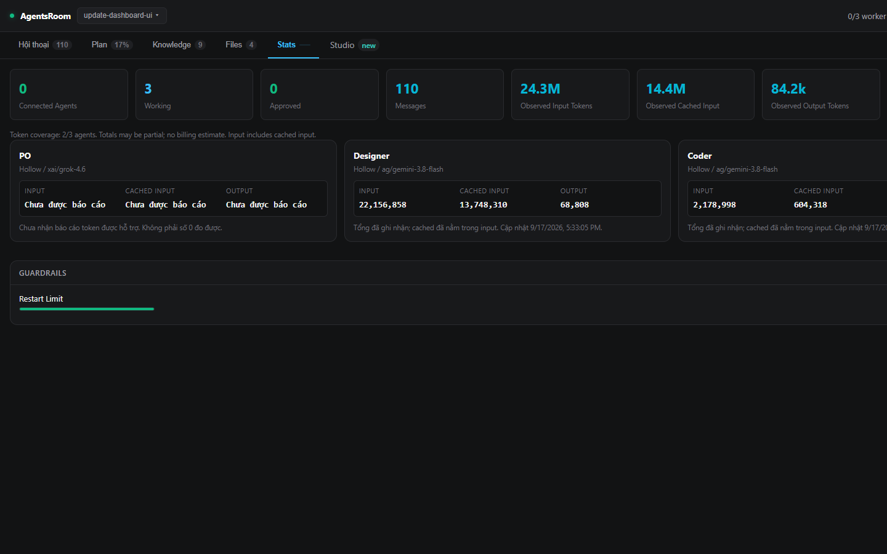
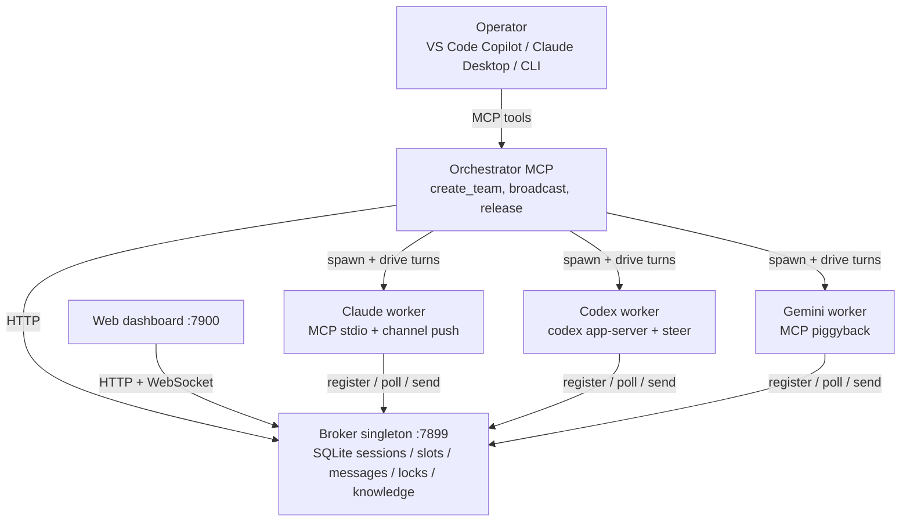
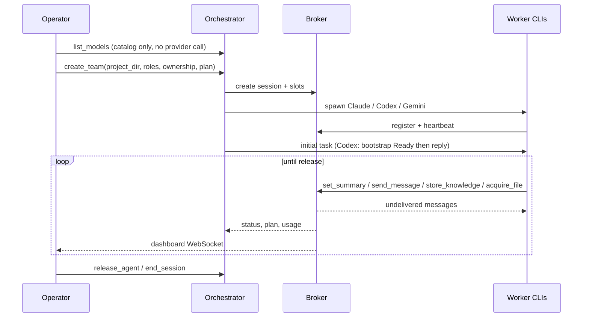
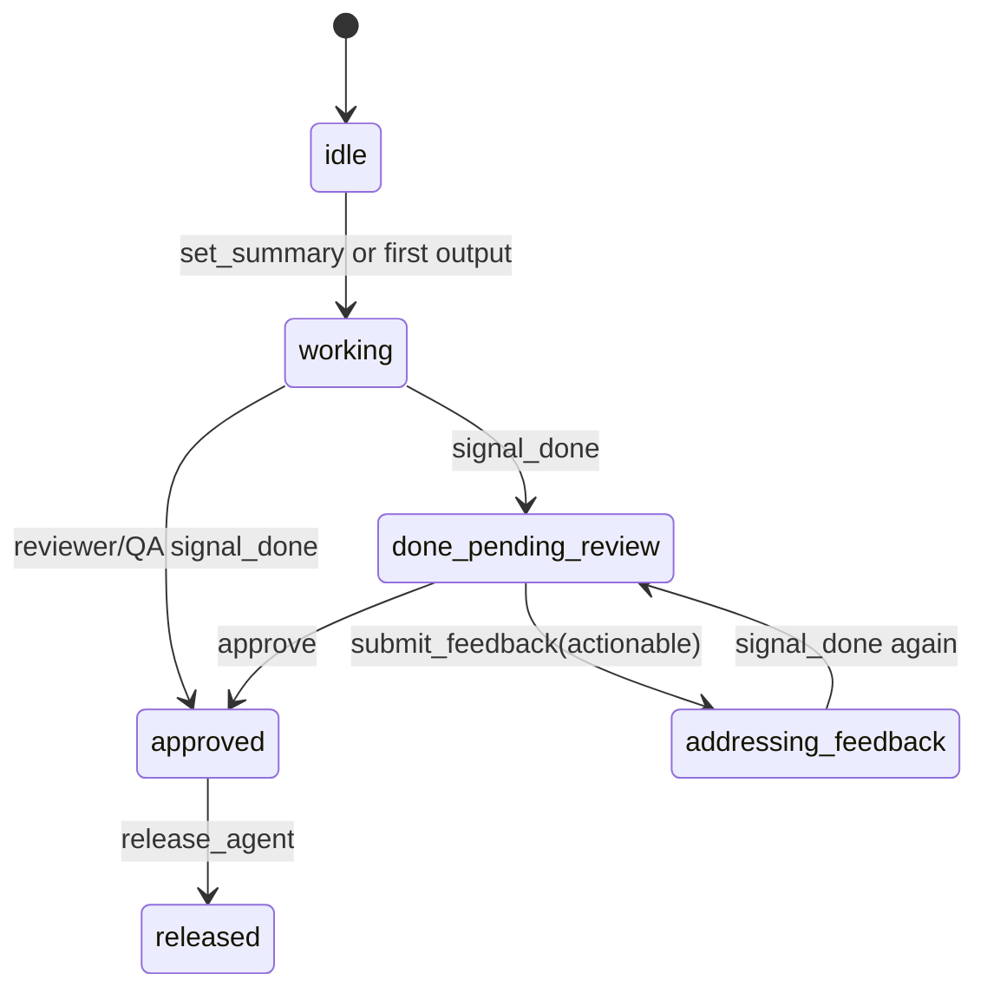

# multiagents

[](https://www.npmjs.com/package/multiagents)
[](https://www.npmjs.com/package/multiagents)

Nền tảng điều phối đa agent cho **Claude Code**, **Codex CLI**, và **Gemini CLI**. Agent tự tìm nhau, nhắn tin thời gian thực, khóa file, làm việc theo team trên cùng codebase.

Xây trên [MCP (Model Context Protocol)](https://modelcontextprotocol.io/).

## Ảnh chụp

Web dashboard tại `localhost:7900` (`start.bat` / `./start.sh` / `multiagents web`). Session sống: hội thoại, plan, knowledge chung, thống kê token.









## Cách hoạt động

Operator nói với **orchestrator**. Orchestrator spawn worker. Worker không gọi API model của nhau. Mọi điều phối đi qua **broker** local (HTTP + SQLite trên `127.0.0.1:7899`): message, slot, file lock, knowledge, plan, usage.



### Khởi chạy team



### Vòng review



Worker giữ kết nối đến khi orchestrator **release**. Ownership file tĩnh (`src/**` vs `tests/**`). File dùng chung: lock hết hạn. Knowledge: key/value theo session, tránh agent tự bịa quyết định lệch nhau.

## Tính năng

- **Peer discovery**: agent tìm nhau qua `list_peers`
- **Nhắn tin thời gian thực**: Claude tức thì (channel push), Codex <3s (mid-turn steer), Gemini 1–3s (piggyback)
- **Gán vai**: `assign_role`, `rename_peer` lúc chạy
- **Điều phối file**: lock độc quyền + ownership zone, tránh conflict
- **Vòng đời task**: `idle → working → done_pending_review → addressing_feedback → approved → released`
- **Vòng review**: `signal_done → submit_feedback → fix → re-review → approve`
- **Knowledge chung**: store key-value bền cho quyết định kiến trúc, pattern, context — chống drift giữa agent
- **Session bền**: sống qua restart, đủ lịch sử message
- **Web dashboard**: hội thoại, plan, knowledge, files, stats, studio trên `localhost:7900`
- **TUI dashboard**: monitor realtime 5 tab (agents, messages, stats, plan, files)
- **Auto-restart**: agent crash respawn kèm handoff context
- **Tắt sạch**: broker và orchestrator kill process mình quản khi thoát

## Bắt đầu nhanh

### Chuyển máy mới

Có. Repo portable. Runtime trên máy thì không. Clone/copy repo, cài runtime, tạo lại MCP config trên máy mới. Không copy config path tuyệt đối cũ, database, worker home, hay credential.

**Mang được:** source, `package.json`, lockfile, `docs/`, và (tuỳ chọn) export team-library đã rà, không secret.

**Gắn máy:** Bun, VS Code/Copilot, CLI Claude Code/Codex/Gemini (tuỳ), `.vscode/mcp.json`, `.multiagents/`, SQLite, Codex worker home, API credential. Session cũ không mang sang; tạo session mới trên máy mới.

### Cài sạch Windows & macOS / Linux

Điều kiện & setup tự động:

- **Windows**:
  - Chạy `setup.bat` một lần trên máy mới. Cài Bun, Node.js 20+, pnpm, dependency (`pnpm install`), và Agent CLI (Claude Code, Codex CLI, Gemini CLI).
  - Chạy bằng `start.bat`.
  - Cập nhật bằng `update.bat`.
- **macOS / Linux**:
  - Chạy `./setup.sh` một lần để cấu hình môi trường và dependency.
  - Chạy bằng `./start.sh`.
  - Cập nhật bằng `./update.sh`.

```bash
# Windows
.\setup.bat   # Cài lần đầu
.\start.bat   # Mở broker & web dashboard
.\update.bat  # Pull code & cập nhật dependency/CLI

# macOS / Linux
./setup.sh    # Cài lần đầu
./start.sh    # Mở broker & web dashboard
./update.sh   # Pull code & cập nhật dependency/CLI
```

### Chạy team lần đầu

Trước `create_team`, xác nhận: đường dẫn tuyệt đối project đích, task, roster worker, ID provider/model từ `list_models`, chi phí dự kiến. Dùng project đích, không dùng repo này, trừ khi đang phát triển chính multiagents. Máy mới thường không có session cũ — đúng. `start.bat` (hoặc `./start.sh` trên macOS/Linux) start hoặc tái dùng broker và web dashboard, rồi mở browser. Script không cấu hình MCP, không tạo team. `start.bat --check` chỉ kiểm tra, không đổi máy.

### VS Code Copilot trên Windows (checkout này)

1. Chạy `setup-copilot.bat` từ checkout này. Kiểm tra điều kiện, ghi workspace `.vscode/mcp.json` cho `multiagents-orch`, path tuyệt đối Bun và orchestrator. Tìm catalog model local, không copy key.
2. Mở checkout trong VS Code, rà trust workspace/server, rồi **MCP: List Servers** để start `multiagents-orch`. Extension-host: nhập provider key chỉ trong ô ẩn của VS Code; provider không dùng để trống. Mode mặc định không cần setup env tay.
3. Mở Copilot **Agent**, bật tool của server, hỏi: "Call `list_models` only and show available provider/model IDs. Do not create a team." Đọc catalog local, không gọi provider, không tính phí worker; thiếu catalog không chặn khám phá MCP tool.

Server interactive `${input:...}` **không forward sang Agent Host**. Dùng extension-host, hoặc chạy lại `setup-copilot.bat --credentials env` và cấp credential thật trong môi trường host launch. Setup không đụng setting global, trust, hay sampling. Xem [hướng dẫn Copilot](docs/copilot-setup.md) cho checklist, hạn chế host, prompt tuỳ chọn `/multiagents`.

MCP thêm tool, không nâng “trí tuệ” model: Copilot Agent vốn đã có tool. Multiagents thêm worker model/context riêng, điều phối bền (lock, knowledge, status, recovery), và quan sát. Team tốn setup, latency, phí provider; Copilot thường đủ cho việc nhỏ. `setup.bat` cài Bun thiếu, dependency, Node.js, Claude Code, Codex CLI, Gemini CLI. `start.bat --check` xem mà không launch. Script không cấu hình MCP, không tạo team.

### Cài CLI

```bash
# Cài global
bun install -g multiagents

# Setup (nhận CLI, cấu hình MCP, start broker)
multiagents setup

# Restart Claude Code / Codex / Gemini để load MCP tool

# Monitor
multiagents dashboard
```

### Từ Claude Desktop (Orchestrator)

Nhờ Claude tạo team:

> "Create a team of 3 agents: a Claude engineer, a Codex reviewer, and a Gemini designer.
> Build a calculator web app in TypeScript."

Orchestrator lo hết: spawn agent, gán vai, tạo slot, mở dashboard, chuyển message giữa agent.

## Hỗ trợ agent

| Agent | Cơ chế giao | Latency | Config |
|-------|-------------|----------|--------|
| Claude Code | Channel push notification | Tức thì | `~/.claude/settings.json` |
| Codex CLI | CodexDriver (`codex app-server`) | &lt;3s mid-turn, 3–9s giữa turn | `~/.codex/config.toml` |
| Gemini CLI | Piggyback trên MCP tool response | 1–3s | `~/.gemini/settings.json` |

### Tích hợp Codex (CodexDriver)

Codex CLI dùng **app-server protocol** — JSON-RPC stdio, thread, turn, notification giàu. Orchestrator dùng **CodexDriver**:

1. Spawn process bền `codex app-server`, handshake JSON-RPC
2. Tạo thread (`thread/start`), chạy turn (`turn/start`)
3. Nhét message giữa turn bằng `turn/steer` — không đợi turn hiện tại xong
4. Cắt turn kẹt bằng `turn/interrupt` khi agent idle &gt;60s
5. Auto-approve request server khởi (chạy lệnh, đổi file, MCP elicitation)
6. Theo token từ notification `turn/completed`

Orchestrator **lái turn Codex**: vòng forward poll broker mỗi 3s. Có turn đang chạy thì steer message ngay. Idle thì `driver.reply()` mở turn mới.

### Catalog model provider

VS Code trên Windows: [setup workspace](docs/copilot-setup.md) tìm `chatLanguageModels.json` user và tham chiếu, không copy. Đường launch khác: đặt `MULTIAGENTS_MODELS_FILE` tới catalog ngoài, hoặc catalog không credential tại `.multiagents/chatLanguageModels.json`. Không copy credential vào project, không commit secret. Tra catalog: path tường minh trước, rồi biến môi trường, rồi default project; path tương đối resolve theo thư mục project (CLI: thư mục hiện tại).

Liệt kê file local, không start broker, không gọi provider, không cần credential:

```bash
bun cli.ts models --file .multiagents/chatLanguageModels.json
bun cli.ts models --file .multiagents/chatLanguageModels.json --json
bun cli.ts models --help
```

Trên setup Windows này, xem trực tiếp (tuỳ chọn): `bun cli.ts models --file "C:\Users\PC\AppData\Roaming\Code\User\chatLanguageModels.json" --json`. Chỉ đọc catalog chỉ định, không đọc setting VS Code hay kho secret. CLI bắt buộc `--file`; JSON chỉ metadata allowlist và tên biến môi trường, không giá trị credential. File thiếu, catalog lỗi, argument lỗi: lỗi đã sanitize, exit khác 0.

- **Credential**: `${input:chat.lm.secret...}` của VS Code không resolve ngoài VS Code. Tên provider suy ra key env: `Hollow` → `HOLLOW_API_KEY`, `ADNX` → `ADNX_API_KEY`. Hoặc `apiKey` catalog dạng `${env:PROVIDER_API_KEY}`. API key literal bị từ chối. Copilot setup mặc định tạo input ẩn mới của VS Code, map sang key env an toàn; không đọc kho secret sẵn. Launch khác hoặc `--credentials env`: cấp credential trong môi trường orchestrator trước khi launch/resume worker.
- **Tương thích**: Chỉ provider `customendpoint` với `apiType: "responses"`. Launch cần model khai `toolCalling: true` và biến env credential có mặt. List không cần credential hay tool calling. Vision, token limit, zero-data-retention: claim catalog, chưa test, không phải cam kết privacy.
- **MCP discovery**: Gọi orchestrator `list_models` với `catalog_path` và `project_dir` tuỳ chọn. Dùng đúng `provider` và `model` trả về trong `create_team.agents[].model_selection` hoặc `add_agent.model_selection`: `{ "provider": "Hollow", "model": "<catalog model ID>", "catalog_path": ".multiagents/chatLanguageModels.json" }`. `catalog_path` tuỳ chọn; `agent_type` phải `"codex"`.
- **Runtime**: Model đã chọn luôn chạy qua Codex app-server, bất kể prefix ID kiểu `ag/`; prefix không chọn Claude hay Gemini. Config theo worker, không sửa Codex global. Provider/model và path catalog tuyệt đối persist cho recovery và MCP `resume_session`; catalog và env credential phải còn. Terminal `session resume` cố ý không hỗ trợ model đã chọn; dùng MCP `resume_session`.
- **Cách ly worker đã chọn**: Worker đã chọn dùng `CODEX_HOME` bền, chỉ owner, dưới `~/.multiagents/codex-workers/<project-session-slot hash>` (`USERPROFILE` trên Windows). Không kế thừa setting Codex global, file login/auth, keyring, hay `.codex/config.toml` của project. Layer config project đánh untrusted trong config riêng; file task và instruction vẫn có. Plugin, gợi ý plugin, sync plugin remote, host skill discovery, analytics: tắt. Chỉ forward biến OS cơ bản, identity/broker worker, và biến credential đã chọn. Credential provider khác, override state Codex kế thừa, biến inject Node/Bun lúc start: không forward. Dùng biến credential provider riêng, không dùng biến điều khiển OS/Codex/multiagents. Agent mặc định, chưa chọn model: không đổi.
- **Vòng đời state riêng**: Config sinh ra chứa tên key env, không giá trị credential. Lịch sử thread nằm cùng private home qua crash và resume; thoát process không xoá. Xoá worker home tay chỉ sau khi session hết cần; xoá mất lịch sử thread native. Launch fail nếu private state nằm trong repo task hoặc không lập được quyền chỉ-owner. Unix: mode thư mục/file `0700`/`0600`; Windows: ACL thư mục worker hạn chế user hiện tại. Policy Codex do máy quản vẫn áp.
- **Regression native offline**: Đặt `MULTIAGENTS_TEST_CODEX_EXECUTABLE` tới `codex`/`codex.exe` đã cài, rồi `bun test tests/selected-codex-native.test.ts`. Không opt-in tường minh thì skip. Dùng setting user/project synthetic ngoài repo, chỉ `initialize`/`config/read`, không thread, turn, hay gọi provider. Routing native hiệu lực và cách ly MCP đã verify với Codex CLI 0.153.4.

## Máy trạng thái task

Mỗi slot agent có `task_state` điều khiển vòng review/approve:

```
                    ┌──────────── (reviewer/QA roles) ────────────┐
                    │                                              ▼
idle ──► working ──► done_pending_review ──► addressing_feedback  approved ──► released
                         │                         │                ▲
                         │                         └────────────────┘
                         └──────────► approved ─────────────────────┘
```

- **idle → working**: tự chuyển khi agent gọi `set_summary` hoặc có output đầu
- **working → done_pending_review**: agent gọi `signal_done`
- **working → approved**: reviewer/QA tự approve khi `signal_done` (không cần review ngoài)
- **done_pending_review → addressing_feedback**: reviewer gọi `submit_feedback(actionable=true)`
- **addressing_feedback → done_pending_review**: agent sửa rồi `signal_done` lại
- **done_pending_review → approved**: reviewer gọi `approve`
- **approved → released**: orchestrator gọi `release_agent`

Agent **không tự disconnect** đến khi được release tường minh. Vòng review phải xong.

## Công cụ MCP (mọi agent)

| Tool | Mô tả |
|------|--------|
| `list_peers` | Tìm agent (lọc scope, type) |
| `send_message` | Gửi text tới peer |
| `check_messages` | Poll message mới |
| `set_summary` | Cập nhật status (peer và dashboard thấy) |
| `check_team_status` | Xem mọi agent: vai, state, summary |
| `get_plan` / `update_plan` | Theo tiến độ plan |
| `signal_done` | Báo xong task (kích review) |
| `submit_feedback` | Gửi feedback review (actionable hoặc informational) |
| `approve` | Approve việc teammate |
| `assign_role` / `rename_peer` | Gán vai và tên |
| `acquire_file` / `release_file` | Quản lý file lock |
| `view_file_locks` | Xem lock đang có và ownership zone |
| `get_history` | Query lịch sử message session |
| `store_knowledge` | Lưu knowledge chung (quyết định, pattern, convention) |
| `query_knowledge` | Query knowledge theo key hoặc category |
| `remove_knowledge` | Xoá knowledge cũ |

## Công cụ Orchestrator (Claude Desktop / VS Code Copilot)

| Tool | Mô tả |
|------|--------|
| `list_models` | List metadata provider/model an toàn từ catalog local (catalog_path, project_dir tuỳ chọn) |
| `create_team` | Spawn team với vai, ownership file, plan |
| `get_team_status` | Status sống mọi agent, theo dõi hoàn thành |
| `broadcast_to_team` | Nhắn mọi agent cùng lúc |
| `direct_agent` | Nhắn một agent theo tên/vai |
| `add_agent` / `remove_agent` | Thêm/bớt agent giữa session |
| `control_session` | Pause/resume tất cả hoặc từng agent |
| `adjust_guardrail` | Xem hoặc đổi giới hạn session |
| `release_agent` / `release_all` | Release agent để disconnect |
| `get_session_log` | Đủ lịch sử message |
| `list_sessions` / `resume_session` | List và resume session cũ |
| `end_session` / `delete_session` | Archive hoặc xoá vĩnh viễn |
| `cleanup_dead_slots` | Gỡ slot disconnect cũ |
| `get_guide` | Tài liệu và tutorial built-in |

## Session

Session sống qua restart agent:

```bash
multiagents session create "Auth Feature"    # Tạo session
multiagents session list                     # List mọi session
multiagents session resume auth-feature      # Resume (respawn agent)
multiagents session pause                    # Pause mọi agent
multiagents session delete auth-feature      # Xoá vĩnh viễn
```

## Điều phối file

**Ownership zone** (tĩnh, không overhead):
```
create_team gán: Engineer owns src/**, Reviewer owns tests/**
```

**File lock** (động, file dùng chung):
```
Engineer: acquire_file("package.json", "adding dependency")
→ Lock được, tự hết hạn sau 5 phút
```

## Knowledge store chung

Agent chia store key-value bền, chống context drift — lỗi số 1 hệ đa agent.

```
Engineer:  store_knowledge("auth-pattern", "JWT with refresh rotation", category="decision")
Designer:  query_knowledge()  →  thấy quyết định trước khi thiết kế auth UI
Reviewer:  query_knowledge(category="decision")  →  review theo quyết định team
```

**Category**: `decision`, `convention`, `discovery`, `blocker`, `context`

Knowledge persist qua restart agent, scope theo session. Agent được bảo query knowledge lúc start, store quyết định khi làm.

## Guardrail

Thống kê monitor session và giới hạn bắt buộc:

| Guardrail | Mặc định | Phạm vi | Hành động |
|-----------|----------|---------|-----------|
| Restart Limit | 5 | Per agent | Stop (chống flap) |
| Session Duration | Monitor | Session | Observe |
| Total Messages | Monitor | Session | Observe |
| Active Agents | Monitor | Session | Observe |
| Longest Idle | Monitor | Per agent | Observe |

Chỉnh từ TUI dashboard (phím +/-) hoặc tool `adjust_guardrail`.

## Web dashboard

```bash
multiagents web [session-id]
```

Dashboard web realtime trên `localhost:7900`, cập nhật WebSocket. Tự mở browser khi team tạo qua orchestrator. 6 tab:

- **Agents**: thẻ agent, trạng thái kết nối, task state, vai, summary, token
- **Messages**: feed message sống, badge type, tên sender
- **Plan**: tiến độ task, thanh hoàn thành, nhãn assignee
- **Knowledge**: entry knowledge chung, category, provenance
- **Files**: file lock và ownership zone
- **Stats**: metric session (agent connected, working, token) và thanh guardrail

Theme tối, layout responsive, shortcut (`1-6` đổi tab).

## TUI dashboard

```bash
multiagents dashboard [session-id]
```

Giao diện terminal 5 tab (cùng data, ANSI):
- **[1] Agents**: trạng thái kết nối, task state, summary
- **[2] Messages**: log message tự cuộn, lọc
- **[3] Stats**: monitor và chỉnh guardrail
- **[4] Plan**: tiến độ, phần trăm hoàn thành
- **[5] Files**: file lock và ownership zone

Phím: `1-5` đổi tab, `j/k` cuộn, `p` pause tất, `r` resume tất, `+/-` chỉnh guardrail, `q` thoát.

## Lệnh CLI

```
multiagents setup                     Wizard setup tương tác
multiagents web [session-id]         Web dashboard (localhost:7900)
multiagents dashboard [session-id]    TUI dashboard
multiagents session <sub>             Quản lý session (create/list/resume/pause/delete)
multiagents send <target> <msg>       Gửi message tới agent
multiagents peers                     List agent đang kết nối
multiagents status                    Sức khoẻ broker + peers
multiagents broker start|stop|status  Quản lý broker daemon
multiagents install-mcp               Cấu hình MCP server
multiagents help [command]            Help chi tiết
```

## Kiến trúc thư mục

```
multiagents/
├── broker.ts               Daemon broker SQLite (sessions, slots, locks, messages, knowledge, guardrails)
├── server.ts               Entry MCP server (dispatch adapter theo --agent-type)
├── cli.ts                  Entry CLI
├── shared/
│   ├── types.ts            Type (Peer, Slot, Session, Message, TaskState...)
│   ├── broker-client.ts    HTTP client API broker
│   ├── constants.ts        Port, interval, ngưỡng
│   ├── summarize.ts        Sinh summary tự động
│   └── utils.ts            Utility chung
├── adapters/
│   ├── base-adapter.ts     Adapter MCP trừu tượng (tool, register, poll)
│   ├── claude-adapter.ts   Adapter Claude Code (channel push)
│   ├── codex-adapter.ts    Adapter Codex (piggyback + file inbox)
│   ├── gemini-adapter.ts   Adapter Gemini (piggyback + file inbox)
│   └── role-practices.ts   Inject best practice theo vai
├── orchestrator/
│   ├── orchestrator-server.ts  MCP orchestrator (quản team)
│   ├── codex-driver.ts     CodexDriver: codex app-server bền qua JSON-RPC (steer/interrupt)
│   ├── launcher.ts         Spawn agent (CLI args, MCP config, CodexDriver)
│   ├── monitor.ts          Monitor process (parse stdout, token)
│   ├── recovery.ts         Phục hồi crash (phát hiện flap, respawn kèm context)
│   ├── progress.ts         Gom status team
│   ├── session-control.ts  Pause/resume/broadcast
│   ├── guardrails.ts       Áp guardrail
│   └── guide.ts            Tài liệu built-in
└── cli/
    ├── commands.ts         Router lệnh CLI
    ├── models.ts           List model provider, không cần broker
    ├── dashboard.ts        TUI dashboard (ANSI, không dependency)
    ├── session.ts          Lệnh quản lý session
    ├── setup.ts            Wizard setup tương tác
    └── install-mcp.ts      Cấu hình MCP server
```

## Vòng đời process

### Tắt sạch
- **Broker** (`SIGINT`/`SIGTERM`): kill mọi process peer đã đăng ký, đóng SQLite sạch
- **Orchestrator** (`SIGINT`/`SIGTERM`): kill mọi process agent quản lý và instance CodexDriver
- **Adapters** (`SIGINT`/`SIGTERM`): huỷ đăng ký broker, nhả file lock

### Chống orphan
- Broker `cleanStalePeers` mỗi 30s: gỡ peer chết, kill process orphan không session
- CodexDriver dùng file sentinel `.multiagents/.driver-mode` để adapter MCP nội bộ không tạo ghost slot
- Handler session delete/end kill cả process thường và CodexDriver
- Phát hiện flap: dừng auto-restart sau 3 crash trong 5 phút

## Biến môi trường

| Biến | Mặc định | Mục đích |
|------|----------|----------|
| `MULTIAGENTS_PORT` | `7899` | Port HTTP broker |
| `MULTIAGENTS_MODELS_FILE` | `.multiagents/chatLanguageModels.json` | Path catalog provider ngoài; path catalog tường minh ưu tiên hơn |
| `MULTIAGENTS_DB` | `~/.multiagents/peers.db` | Path SQLite |
| `MULTIAGENTS_SESSION` | - | Session ID (orchestrator set) |
| `MULTIAGENTS_SLOT` | - | Slot ID (orchestrator set) |
| `MULTIAGENTS_ROLE` | - | Vai agent (orchestrator set) |
| `MULTIAGENTS_NAME` | - | Tên hiển thị agent (orchestrator set) |
| `MULTIAGENTS_DRIVER_MODE` | - | Bỏ đăng ký adapter (CodexDriver set) |

## Yêu cầu

- Runtime [Bun](https://bun.sh/) (v1.1+)
- Ít nhất một trong: Claude Code, Codex CLI, hoặc Gemini CLI

## Giấy phép

MIT
